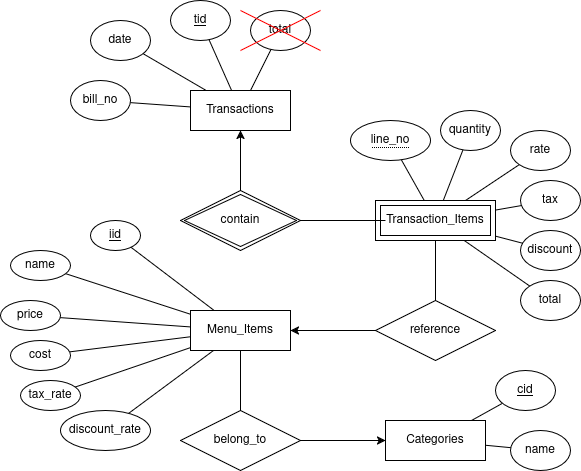

# Dashboard for Point-of-Sales Data

- Dataset: [Point-of-sales (POS) data from a café (Kaggle)](https://www.kaggle.com/datasets/ankitverma2010/cafe-data)
  - Dataset used to seed the database, but it will be possible to simulate POS transaction events.
- Task: Create a dashboard that will give the business owner an overview over his sales.

### Installation

You will need npm and Docker. From the root of the directory, run

```bash
npm install
```

### Database Setup

#### Postgres

The database's docker container is defined in `docker-compose.yaml`. \
To get it running, you will need Docker. Run

```bash
# Might need sudo, depending on Docker installation
sudo docker compose up -d
```

You can check that the records have been created by running postgres in the docker container:

```bash
sudo docker exec -it postgres bash
```

#### Seeding the Database

Now that you have a postgres instance up and running, you can start populating the database. \
To do so, you will need npm. Running

```bash
npm run db:seed:small
```

will do the following:
- Compile various scripts to do with the database.
- Creates a more current version of the dataset from 2010, where the date of the last record is the current date.
- Uses that dataset to populate the database.

The command above does so with a small dataset of only 20 rows, in case something goes wrong. If everything goes well, and there are no errors, go ahead and populate the database with these 145830 records (it might take a while):

```bash
npm run db:seed:full
```

To check that the database was corrected populated, open postgres inside the docker container and do a query:

```bash
sudo docker exec -it postgres bash
psql -U postgres pos_dashboard
```

For example,

```sql
SELECT COUNT(*) FROM transaction_items;
```

### Run the Server

To compile and run the server, run

```bash
npm run build
npm run start
```

After which you will get a link to localhost port 3000:

```
> project@0.1.0 start
> next start

   ▲ Next.js 15.3.1
   - Local:        http://localhost:3000
   - Network:      http://192.168.0.222:3000

 ✓ Starting...
 ✓ Ready in 679ms
```

### Transaction Schema

Here are the first two records of the dataset:

| date           | Bill Number | Item Desc                 | Quantity | Rate | Tax   | Discount | Total  | Category |
| -------------- | ----------- | ------------------------- | -------- | ---- | ----- | -------- | ------ | -------- |
| 4/1/2010 13:15 | G0470115    | QUA MINERAL WATER(1000ML) | 1        | 50   | 11.88 | 0        | 61.88  | BEVERAGE |
| 4/1/2010 13:15 | G0470115    | MONSOON MALABAR (AULAIT)  | 1        | 100  | 23.75 | 0        | 123.75 | BEVERAGE |

### E/R Chen Diagram

There are **Transactions**, **Transaction_Items**, **Menu_Items** and **Categories**.

Relations:

- Transactions contain Transaction_Items (1-m)
  - Transaction_Items are weak entities.
- Transaction_Items reference Menu_Items (m-1)
- Menu_Items belong_to Categories (m-1)

Keys:
Don't know the canonical way to express this, but:

- Transactions: `tid` is the primary key
- Transaction_Items is a weak entity set. Composite key: `(tid, line_no (weak))`
- Menu_Items: `iid`
- Categories: `cid`



### Parsing and Database Modules

As per the assignment, I have created parsers from context-free grammars. They are located in `src/db/parsing/`. \
These parsers are used in seeding the database.

Most modules relevant to this course live inside `src/db`.:

```
src/db
├── parsing
│   ├── bill-no.ts
│   ├── category.ts
│   ├── date.ts
│   ├── ...
│   └── pos-record.ts
├── pos-record.ts
├── read-dataset.ts
├── scripts
│   ├── make-current.ts
│   ├── populate-db.ts
│   └── reset-db.ts
├── serialize.ts
└── transform-dataset.ts
```

The API with all the SQL queries for the dashboard are defined in the API routes in `src/app/api/`:

```
src/app/api/
├── profit-margin
│   └── route.ts
├── sales-over-time
│   └── route.ts
├── top-5-products
│   └── route.ts
├── total-cost
│   └── route.ts
├── total-profit
│   └── route.ts
├── total-revenue
│   └── route.ts
└── utils
    └── interval-pair.ts
```

### Components of the Dashboard

Site will include two pages:

- Dashboard
- ~~New transaction~~ (I did not have time for this)

In 'New transaction', the user can simulate a transaction (a sale). User will choose some items to "buy". The transaction will be reflected in the dashboard.

I have created a wireframe for the dashboard.
It includes a global period picker (24H, 7D, 30D, YTD, 1Y and Max) and

- Four KPIs:
  - Total Revenue
  - Total Cost
  - Total Profit
  - Profit Margin (%)
- Two charts:
  - Sales over time (line chart)
  - Top products by profit (bar chart, top 5)
- Transactions (scrollable list view, last 100)

All in rupees, since the dataset is Indian.

Here is the wireframe for the dashboard page:


### Frontend Implementation

The frontend is mostly [ShadCN/UI components](https://ui.shadcn.com/) making calls to my API.
